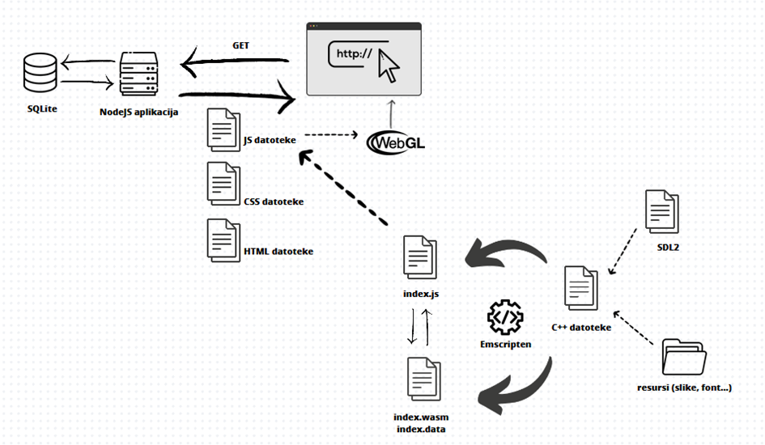

A space-themed endless runner game, created using WebAssembly with C++ and SDL2. Developed as the practical part of the bachelor thesis "Using C++ programming language in web application development".

# Installation

From root directory: 

```
npm install
node server.js
```

Go to: `http://localhost:3000`

# Description

A web application that allows playing the game in the browser and monitoring the results achieved in the game. It consists of two web pages, one for the game (URL: `/game`) and one for the leaderboard (URL: `/leaderboard`). On the game page there are two canvas HTML elements that provide a double view of the game with the left view being in 2D and the right view being in 3D. The genre of the game is an infinite runner, which means that the player's character moves forever through the game space while avoiding obstacles and collecting points, that is, the game has no victory condition and ends only when the player loses all lives. In the game, the player gains 10 lives and loses a life every time they collide with enemy ships, while collecting objects that bring points which increase the score. The player also has the option to shoot and destroy enemy objects. When the player reaches zero lives, the game ends and displays the score and options to replay and enter a username. The results web page displays information about the usernames entered by the players at the end of the game and the points scored.

# Technologies

- C++, WebAssembly and Emscripten
- Client side: HTML, CSS, JavaScript, ThreeJS, WebGL
- Server side: NodeJS and Express
- Database: SQLite 

For the game, most of the logic is made in C++ language, which primarily refers to its 2D display, for which the SDL2 library was used, which provides low-level access to multimedia capabilities such as graphics, keyboard, mouse, and the like. A smaller component of the game consists of a 3D display for which client-side technologies, namely HTML, CSS and JavaScript, and the ThreeJS JavaScript library were used. Integration of logic in C++ language into the web application was achieved through WebAssembly, and Emscripten, a set of code translation tools, was used for translation into WebAssembly format.

# Architecture



